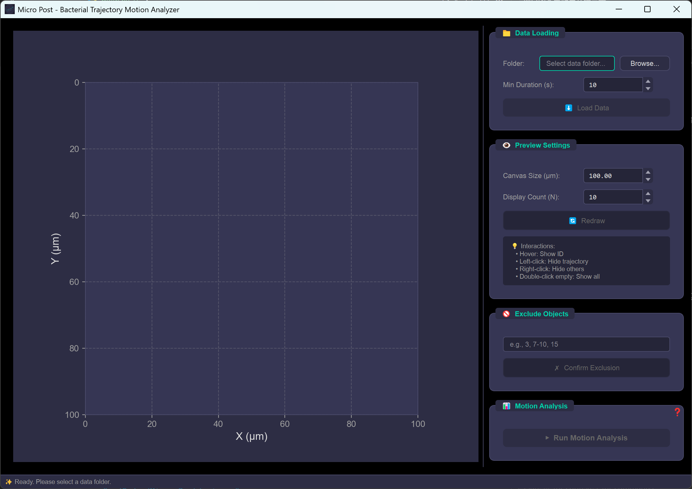

# Micro Post - Bacterial Trajectory Motion Analyzer


**Version 1.2** | **Release Date: 2026-01-13**

A professional desktop application for comprehensive motion analysis of bacterial trajectories from tracking data. Features a modern dark tech UI theme with interactive trajectory visualization and advanced motion analytics.

## Table of Contents

- [Features](#features)
- [Screenshots](#screenshots)
- [Installation](#installation)
  - [Prerequisites](#prerequisites)
  - [Setup with Conda (Recommended)](#setup-with-conda-recommended)
  - [Setup with pip](#setup-with-pip)
- [Usage](#usage)
  - [Running the Application](#running-the-application)
  - [Workflow](#workflow)
  - [Trajectory Preview Interactions](#trajectory-preview-interactions)
- [Input Data Format](#input-data-format)
  - [Expected File Structure](#expected-file-structure)
  - [Excel File Format](#excel-file-format)
- [Output](#output)
  - [Trajectories_Summary.xlsx](#trajectories_summaryxlsx)
- [Technical Details](#technical-details)
  - [Angular Displacement Calculation](#angular-displacement-calculation)
  - [Mean Squared Displacement (MSD)](#mean-squared-displacement-msd)
  - [Mean Squared Angular Displacement (MSAD)](#mean-squared-angular-displacement-msad)
  - [Oscillation Index](#oscillation-index)
  - [Trajectory Ellipse Fitting](#trajectory-ellipse-fitting)
- [Project Structure](#project-structure)
- [Requirements](#requirements)
- [Contributing](#contributing)
- [Changelog](#changelog)
- [License](#license)
- [Author](#author)

## Features

- **Data Loading & Validation**: Automatically search and validate trajectory Excel files with parameter consistency checking
- **Data Filtering & Merging**: Filter objects by minimum tracking duration and merge into a unified summary file
- **Interactive Trajectory Preview**:
  - Visualize trajectories with mouse interactions (hover, click, double-click)
  - Zoom in/out with scroll wheel centered on mouse position
  - Reset zoom with middle mouse button
- **Manual Object Exclusion**: Exclude specific objects by ID number
- **Comprehensive Motion Analysis**:
  - Displacement (X/Y and total)
  - Angular displacement with 180° wrapping handling
  - Instantaneous velocity
  - Mean Squared Displacement (MSD)
  - Mean Squared Angular Displacement (MSAD)
  - Trajectory ellipse fitting
  - Oscillation index (PCA-based)
  - Summary statistics with standard deviations
- **MSD/MSAD Curve Fitting**:
  - Constant Velocity Drift Model: MSD(t) = 4D_T·t + V²t²
  - Active Diffusion Model: MSD(t) = 4D_eff·(t - τ_r·(1-exp(-t/τ_r)))
  - Automatic fitting with R² goodness-of-fit
  - Journal-quality fitting result plots
- **Modern Dark Tech UI**: Card-based layout with accent colors and smooth interactions

## Screenshots

### Main Application Window



The main interface features a modern dark tech theme with:

- **Left Panel**: Interactive trajectory visualization canvas with zoom and pan capabilities
- **Right Panel**: Control sections for data loading, preview settings, object exclusion, and motion analysis
- **Status Bar**: Real-time feedback and instructions

## Installation

### Prerequisites

- Python 3.10 or higher
- Conda (recommended) or pip

### Setup with Conda (Recommended)

```bash
# Create a new conda environment
conda create -n micro_post python=3.10
conda activate micro_post

# Install dependencies
pip install -r requirements.txt
```

### Setup with pip

```bash
# Create virtual environment
python -m venv venv

# Activate (Windows)
.\venv\Scripts\activate

# Activate (macOS/Linux)
source venv/bin/activate

# Install dependencies
pip install -r requirements.txt
```

## Usage

### Running the Application

```bash
python main.py
```

### Workflow

1. **Select Data Folder**: Click "Browse..." to select the folder containing trajectory Excel files
2. **Set Minimum Duration**: Adjust the minimum tracking duration threshold (default: 10s)
3. **Load Data**: Click "Load Data" to search, validate, and merge trajectory data
4. **Preview Trajectories**:
   - Adjust canvas size and display count
   - Click "Redraw" for random trajectory selection
   - Interact with trajectories using mouse
   - Use scroll wheel to zoom in/out for detailed observation
5. **Exclude Objects**: Enter object numbers to exclude (e.g., "3, 7-10, 15")
6. **Run Analysis**: Click "Run Motion Analysis" to perform comprehensive motion analysis

### Trajectory Preview Interactions

| Action                  | Effect                       |
| ----------------------- | ---------------------------- |
| Hover (within 5px)      | Show trajectory ID           |
| Left-click              | Hide clicked trajectory      |
| Right-click             | Hide all other trajectories  |
| Double-click empty area | Show all trajectories        |
| Scroll wheel up         | Zoom in (centered on mouse)  |
| Scroll wheel down       | Zoom out (centered on mouse) |
| Middle-click            | Reset zoom to original view  |

## Input Data Format

### Expected File Structure

```
DataFolder/
├── GroupA/
│   ├── Results_GroupA-01/
│   │   └── Trajectories_Results_GroupA-01.xlsx
│   └── Results_GroupA-02/
│       └── Trajectories_Results_GroupA-02.xlsx
└── GroupB/
    └── ...
```

The application searches up to 3 levels of subdirectories for trajectory files.

### Excel File Format

Each `Trajectories_Results_*.xlsx` file should contain:

1. **Parameters Sheet**: Experiment parameters

   - FPS, Pixel Scale, Filter settings, etc.
   - Note: `Video Path`, `Mask Directory`, `Exclude Object IDs`, `Total Objects`, `Passed Objects`, and `Filtered Objects` are excluded from consistency checks

2. **Object_N Sheets**: Trajectory data with columns:
   - `time (s)`: Time in seconds
   - `area (μm²)`: Object area
   - `center_x (μm)`: X position
   - `center_y (μm)`: Y position
   - `major axis length (μm)`: Major axis length
   - `minor axis length (μm)`: Minor axis length
   - `posture angle (°)`: Orientation angle (0-180°)

## Output

### Trajectories_Summary.xlsx

The analysis generates a summary Excel file in the selected data folder with auto-adjusted column widths.

### Fitting_Results.png

A journal-quality figure showing MSD and MSAD fitting results with:

- Original data curves with standard deviation error bands
- Fitted curves with model equations
- Fitting parameters and R² values
- Fitting range indicators

1. **Parameters Sheet**: Experiment parameters + Data Path + Fitting Model + Fitting Range
2. **Source Sheet**: Object source information (original file and ID)
3. **Summary Sheet**: Aggregated statistics organized by column:
   - Global statistics (Area, Aspect Ratio, Max displacements, Ellipse fitting, Oscillation index)
   - Fitting results (D_T/D_eff, V/τ_r, D_R, MSD R², MSAD R²)
   - Lag-time dependent statistics (tau, Count, Mean velocities, Angular displacement, MSD, MSAD)
   - All values include mean and standard deviation
4. **Object_N Sheets**: Individual trajectory data with analysis columns:
   - `aspect_ratio`: Minor/major axis ratio
   - `dx (μm)`, `dy (μm)`, `displacement (μm)`: Displacements from start
   - `angular_displacement (rad)`: Angular displacement from initial posture
   - `vx (μm/s)`, `vy (μm/s)`, `speed (μm/s)`: Instantaneous velocities
   - `mean_vx (μm/s)`, `mean_vy (μm/s)`, `mean_speed (μm/s)`: Mean velocities for each lag time
   - `mean_angular_disp (rad)`: Mean angular displacement for each lag time
   - `tau (s)`, `MSD (μm²)`, `MSAD (rad²)`: Lag-time dependent quantities
   - `max_dx (μm)`, `max_dy (μm)`: Maximum displacements
   - `ellipse_major (μm)`, `ellipse_minor (μm)`: Trajectory ellipse axes
   - `ellipse_aspect_ratio`: Trajectory ellipse aspect ratio
   - `oscillation_index`: Trajectory oscillation coefficient

## Technical Details

### Angular Displacement Calculation

For 180° symmetric objects (bacteria), angular changes >90° are adjusted:

- If Δθ > 90°, Δθ = Δθ - 180°
- If Δθ < -90°, Δθ = Δθ + 180°

This ensures continuous angular tracking without artificial jumps.

### Mean Squared Displacement (MSD)

Calculated for lag times τ from 0 to (trajectory length - 1):

```
MSD(τ) = <[x(t+τ) - x(t)]² + [y(t+τ) - y(t)]²>
```

### Mean Squared Angular Displacement (MSAD)

Similar to MSD but for angular displacement with 180° wrapping:

```
MSAD(τ) = <[θ(t+τ) - θ(t)]²>  (in rad²)
```

### Oscillation Index

Calculated using PCA analysis:

1. Find principal axis direction of trajectory points
2. Axis passes through trajectory centroid
3. Compute perpendicular distance from each point to axis
4. Oscillation index = mean of squared distances

### Trajectory Ellipse Fitting

Uses OpenCV's convex hull + fitEllipse method for minimum bounding ellipse of trajectory points.

### MSD/MSAD Curve Fitting

Two fitting models are available:

**Constant Velocity Drift Model:**

```
MSD(t) = 4·D_T·t + V²·t²
MSAD(t) = 2·D_R·t
```

- D_T: Translational diffusion coefficient (μm²/s)
- V: Drift velocity (μm/s)
- D_R: Rotational diffusion coefficient (rad²/s)

**Active Diffusion Model:**

```
MSD(t) = 4·D_eff·(t - τ_r·(1 - exp(-t/τ_r)))
MSAD(t) = 2·D_R·t
```

- D_eff: Effective diffusion coefficient (μm²/s)
- τ_r: Direction persistence time (s)
- D_R: Rotational diffusion coefficient (rad²/s)

Fitting is performed on data from τ = 0 to τ = max_tau/2.

## Project Structure

```
Micro Post/
├── main.py                      # Application entry point
├── requirements.txt             # Python dependencies
├── README.md                    # This file
├── LICENSE                      # MIT License
└── src/
    ├── __init__.py
    ├── core/
    │   ├── __init__.py
    │   ├── data_loader.py       # Excel file loading and validation
    │   ├── data_manager.py      # Data filtering, merging, and saving
    │   └── motion_analyzer.py   # Motion analysis calculations
    ├── ui/
    │   ├── __init__.py
    │   ├── main_window.py       # Main application window
    │   ├── trajectory_canvas.py # Interactive Matplotlib canvas
    │   ├── theme.py             # UI color and style constants
    │   ├── styles.py            # QSS stylesheet
    │   └── resources/           # UI resources (icons)
    └── utils/
        ├── __init__.py
        ├── logger.py            # Logging configuration
        └── ellipse_fitting.py   # Ellipse fitting utilities
```

## Requirements

### System Requirements

- **Operating System**: Windows 10/11, macOS 10.14+, or Linux
- **Python Version**: 3.10 or higher
- **Memory**: Minimum 4GB RAM (8GB recommended for large datasets)
- **Disk Space**: 500MB for installation and dependencies
- **Display**: 1280x720 minimum resolution (1920x1080 recommended)

### Python Dependencies

All required Python packages are listed in `requirements.txt` and will be installed automatically during setup.

| Package       | Version   | Purpose              |
| ------------- | --------- | -------------------- |
| PyQt6         | >= 6.4.0  | GUI framework        |
| pandas        | >= 2.0.0  | Data manipulation    |
| numpy         | >= 1.24.0 | Numerical computing  |
| openpyxl      | >= 3.1.0  | Excel file I/O       |
| scipy         | >= 1.10.0 | Scientific computing |
| scikit-learn  | >= 1.2.0  | PCA analysis         |
| matplotlib    | >= 3.7.0  | Data visualization   |
| opencv-python | >= 4.8.0  | Ellipse fitting      |

## Contributing

Contributions are welcome! Please feel free to submit issues, feature requests, or pull requests.

### How to Contribute

1. **Fork the repository**
2. **Create a feature branch**: `git checkout -b feature/your-feature-name`
3. **Commit your changes**: `git commit -m 'Add some feature'`
4. **Push to the branch**: `git push origin feature/your-feature-name`
5. **Open a Pull Request**

### Development Guidelines

- Follow PEP 8 style guide for Python code
- Add unit tests for new features
- Update documentation as needed
- Ensure all tests pass before submitting

## Changelog

### Version 1.2 (2026-01-13)

**Bug Fixes & Improvements**

- 🐛 **Fixed**: Maximum displacement calculation now correctly computes trajectory bounding box dimensions (width and height) instead of displacement from origin
- ✨ **Enhanced**: Excel export formatting improvements:
  - Unified Arial font (10pt) for all cells across all sheets
  - Bold formatting for header rows for better readability
  - Improved column width auto-adjustment (min: 10, max: 60, padding: 3)
  - Enhanced content display ensuring all data is fully visible
- 📝 **Updated**: Documentation to reflect corrected maximum displacement calculation method

### Version 1.1 (2026-01-07)

**Initial Release**

- ✨ Data loading and validation with parameter consistency checking
- ✨ Data filtering and merging by minimum tracking duration
- ✨ Interactive trajectory preview with zoom and pan capabilities
- ✨ Manual object exclusion by ID numbers
- ✨ Comprehensive motion analysis:
  - Displacement (X/Y and total)
  - Angular displacement with 180° wrapping
  - Instantaneous and lag-time averaged velocities
  - Mean Squared Displacement (MSD)
  - Mean Squared Angular Displacement (MSAD)
  - Trajectory ellipse fitting
  - Oscillation index (PCA-based)
- ✨ MSD/MSAD curve fitting:
  - Constant Velocity Drift Model
  - Active Diffusion Model
  - Journal-quality fitting result plots
- ✨ Summary statistics with mean and standard deviation
- ✨ Modern dark tech UI with card-based layout
- 📄 Comprehensive user manual in HTML format
- 📦 Excel output with auto-adjusted column widths

## License

MIT License

Copyright (c) 2026 Lucien

See [LICENSE](LICENSE) for details.

## Author

**Lucien** - lucien-6@qq.com
